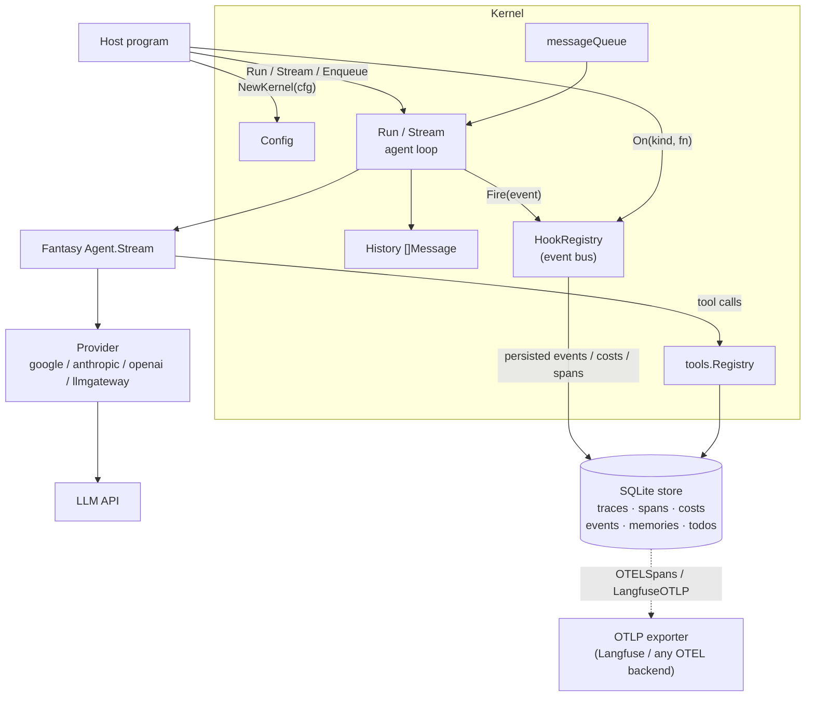
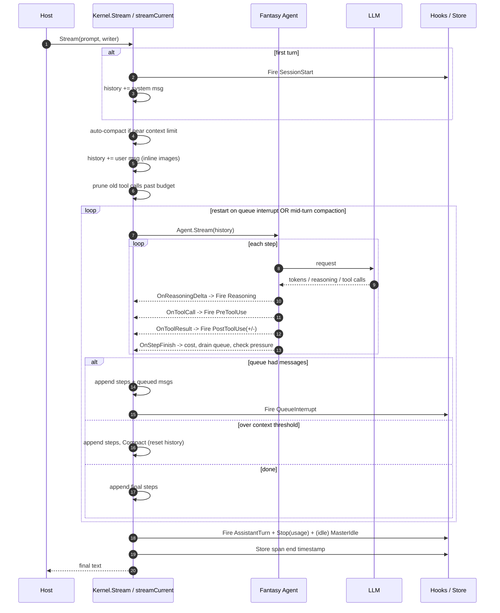
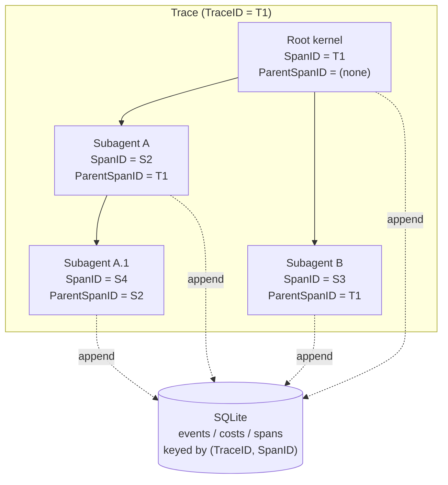
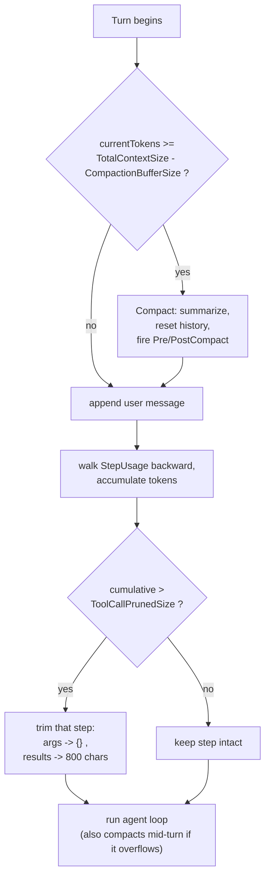
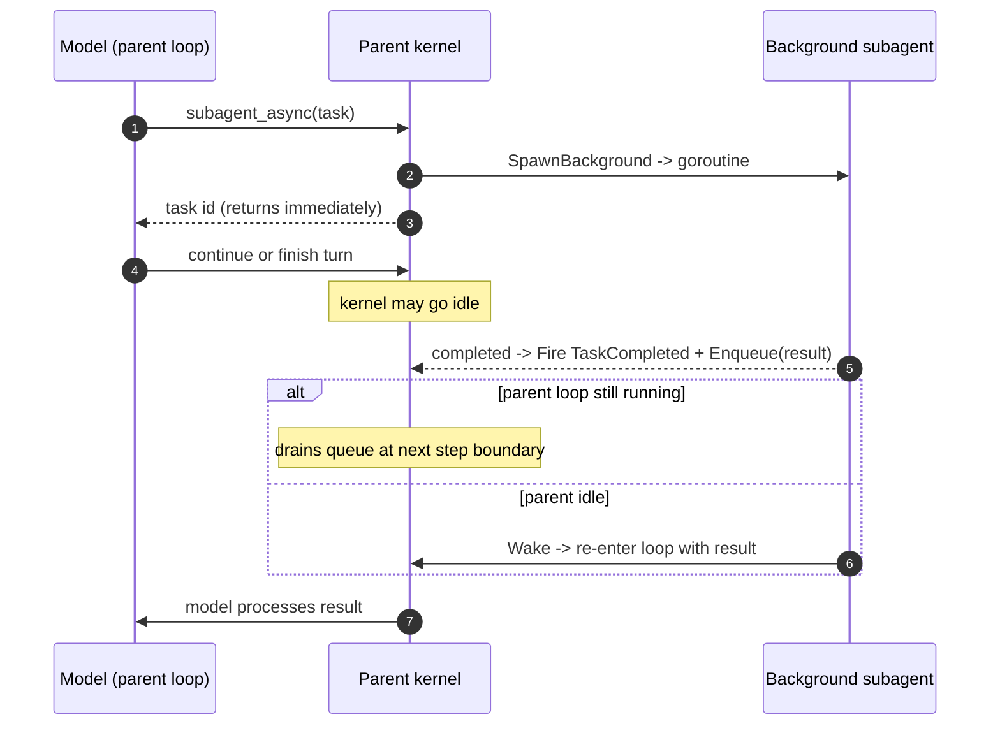
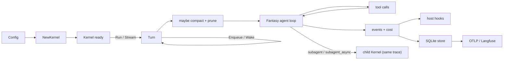
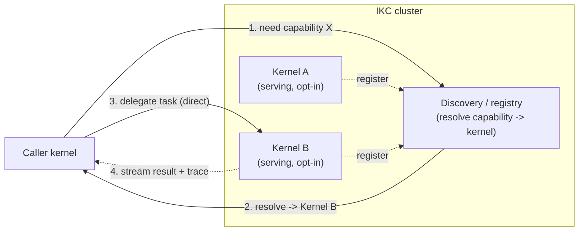

# toroid-kernel — Architecture Explainer

> An embeddable Go kernel for tool-using LLM agents.

Source: [github.com/yashbonde/toroid-kernel](https://github.com/yashbonde/toroid-kernel) · ~3,200 LOC Go · built on [charm.land/fantasy](https://charm.land/fantasy) · reflects the code as of this update (2026-06-23).

> **What it is in one line.** A library — not a CLI or a TUI — that you `import` into a Go program to run a tool-calling agent loop with streaming, per-step cost accounting, resumable persistence, OpenTelemetry-native tracing, conversation compaction, loop guards, structured output, image input, synchronous *and* background subagents, and a built-in tool registry. The host program owns the UI and the lifecycle; the kernel owns the loop.

This explainer walks the system as built (§1–§12): construction and wiring, the turn loop, tools, providers, the single SQLite persistence store, OTEL-native telemetry with an OTLP exporter, context management, the message queue, sub/background agents, and the event bus. §13 is the remaining roadmap — inter-kernel communication and permission gating — which is designed but not yet code.

---

## 1. The big picture

A host program constructs a `Kernel` from a `Config` and calls `Run` (buffered) or `Stream` (incremental). The kernel wires a *provider* (Google / Anthropic / OpenAI-compatible / LLM-gateway), a *tool registry*, an *event/hook bus*, and — when `Save` is set — a single embedded *SQLite store* that holds traces, spans, costs, events and memories (the todo table lives in the same database). The agent loop itself is delegated to Fantasy's `Agent.Stream`; the kernel sits around it, translating Fantasy callbacks into kernel *events* and managing history, cost, compaction, loop guards, and the message queue.

## 2. Construction: `NewKernel`

[`NewKernel`](../kernel.go#L111) is where everything is resolved and wired, in order:

- **Defaults** — API key falls back to `GEMINI_TOKEN`; a Snowflake-based `SessionID` is generated; `WorkDir` defaults to a per-session runner dir; `ApplyDefaultDataTypes` fills the rest. The default model is `anthropic/claude-haiku-4-5`.
- **Trace root** — if `TraceID` is empty it is set equal to `SessionID`. This is the marker of a *root* kernel; subagents inherit the parent's `TraceID` instead.
- **Store** — opened only when `Save` is true. One shared SQLite handle backs both the trace store and the todo tools. On a non-root span it *reconstructs history* by replaying stored events (resume).
- **Tools** — when `IncludeComputerTools` is set, `NewKernel` registers the thirteen built-ins; their short descriptions are read from the second line of each `*.tool.tmpl` file. Host-supplied `Config.Tools` are merged in too.
- **System prompt** — `system.tmpl` is rendered with `WorkDir` and `Date`.
- **Provider + model** — resolved from the `provider/model` ID, then the `provider/` prefix is stripped before asking for the `LanguageModel`.
- **Loop guards** — two Fantasy stop conditions are wired: `MaxIter` (default 50) caps the absolute number of tool-call steps via `StepCountIs`, and `MaxRepeatCalls` (default 3) trips a custom `repeatCallGuard` when consecutive steps issue identical tool calls with identical results. Both halt cleanly at a step boundary.
- **Thinking** — when `Thinking` is not `none`, a Google thinking-budget/level config is added (`low`≈1k, `high`≈8k tokens; gemini-3 uses thinking *levels*), and reasoning deltas can stream to `ThinkingWriter`.
- **Agent options** — system prompt, tools, `MaxRetries(5)`, stop conditions, and the optional thinking config are assembled into `FantasyAgentOpts`, reused on every turn.

## 3. The turn: `Stream`

[`Stream`](../kernel.go#L503) runs one user turn: it fires `SessionStart` on the first turn, auto-compacts if near the limit, appends the (image-aware) user message, prunes old tool calls past budget, and then hands off to [`streamCurrent`](../kernel.go#L690), which owns the agent loop. The real subtlety lives in `streamCurrent`'s **restart loop**: the kernel lets Fantasy stream to a natural stop, but if messages were enqueued *or* the context crossed the compaction threshold at a step boundary, it appends the collected steps, injects what is needed (queued messages, or a fresh compaction summary), and restarts the stream — this is how mid-run input and mid-turn context overflow are absorbed without corrupting history. The loop is serialized by `runMu` so `Stream` and `Wake` (§9) never mutate history concurrently.

### Per-step cost accounting

On every `OnStepFinish` the step's Fantasy usage is converted to a `Usage` (with USD cost from [`pricing.go`](../pricing.go)), accumulated into `runningCostUSD`, appended to `StepUsage`, persisted via `AppendCost`, and emitted as an `EventTurnCost`. The same callback is the **safe interruption point** where the message queue is drained and context pressure is re-checked.

### Structured output

`Run`/`Stream` accept a [`WithSchema(schema, name, description)`](../kernel.go#L483) option. When set, the free-text loop output is discarded; after the agentic loop the kernel appends a "return your findings in the required JSON format" user turn and calls `LanguageModel.GenerateObject`, writing the validated JSON to the caller's writer instead of prose.

## 4. Tools and the registry

Each tool is a `ToolDef` pairing a `fantasy.AgentTool` (the executable, schema-bearing function) with a `*.tool.tmpl` documentation file. The registry is a name-keyed map. The thirteen built-ins cover file/shell/search/planning/notification/delegation:

| Tool | Purpose | Notable behavior |
|------|---------|------------------|
| `read` | Read file or list directory | Line numbers, 2000-line / 2000-char caps, binary detection, offset paging |
| `write` | Write a file | Creates parent dirs |
| `edit` | Exact-string replace | Fails if `oldText` is missing or non-unique |
| `multiedit` | Batched edits to one file | — |
| `ls` / `glob` / `grep` | List / find / content search | Scoped to the working directory |
| `bash` | Run a shell command | Combined output truncated at 20k chars; no timeout arg |
| `todowrite` / `todoread` | Task list | Persisted in the shared SQLite DB, keyed by session |
| `notify` | Notification | Fires `EventNotification` on the bus + best-effort desktop notifier (macOS / Linux / Windows) + any registered `NotifySink` |
| `subagent` | Delegate a subtask synchronously | In-process child kernel; parent blocks |
| `subagent_async` | Delegate a subtask in the background | Returns a task id immediately; wakes the parent on completion (§9) |

> **Note.** Tool failures are returned as ordinary text beginning with `"Error:"`; in [`OnToolResult`](../kernel.go#L765) the kernel sniffs that string prefix to decide between `PostToolUse` and `PostToolUseFailure`. The result is now carried in a structured `ToolUseResultPayload` (with a dedicated `Error` field populated on the failure path), but the failure *detection* is still string-prefix based rather than a structured error flag from the tool.

### Image input

User prompts go through [`parseUserMessage`](../multimodal.go#L22), which scans for markdown image refs ``, loads each readable model-supported media file as a `fantasy.FilePart`, and splices it into the user turn as text→image→text parts. The persisted form of the prompt rewrites the path to a `~`-rooted absolute path so a session resumed from any directory still resolves the same file. Unresolvable refs are left as literal text.

## 5. Providers

[`NewProviderFromLLMId`](../provider.go#L22) maps the prefix of a `provider/model` ID to a Fantasy provider. `google` (and the empty default) and `anthropic` use native providers; `openai` and `llmgateway` both use the OpenAI-compatible provider — the gateway variant just points it at a self-hosted base URL (e.g. a LiteLLM proxy) from `LLM_GATEWAY_BASE_URL` and authenticates with a bearer token.

## 6. Persistence: one SQLite store

Persistence is consolidated on a **single embedded SQLite database** (`~/.swarmbuddy/sql.db`, opened with WAL + busy-timeout, via the pure-Go `modernc.org/sqlite` driver — no cgo). One process-global handle is shared between the trace [`Store`](../store.go) and the todo tools, so there is no inter-store lock contention. The [schema](../store.go#L49) is five tables:

| Table | Holds | Key / index |
|-------|-------|-------------|
| `traces` | Per-trace metadata (title, start/end, previous trace id) | `trace_id` |
| `spans` | Per-span (kernel session) metadata (parent, model, start/end) | `(trace_id, span_id)` |
| `costs` | Per-turn cost rows (turn + cumulative USD) | `(trace_id, span_id, ts)` |
| `events` | Full-fidelity session events as JSON | `(trace_id, span_id, seq)` |
| `memories` | Per-span agent memory JSON blob | `span_id` |

Every kernel is a **span**; the tree of kernels sharing a `TraceID` is a **trace**. A root kernel has `TraceID == SessionID`; a subagent inherits its parent's `TraceID` and sets `ParentSpanID` to the parent's `SessionID`. Span (and, for the root, trace) **start and end timestamps** are recorded via `SaveSpanMeta`/`SaveTraceMeta`, and all events except the high-volume display-only `Reasoning` are appended. `Close()` checkpoints the WAL but intentionally leaves the shared handle open for other live kernels; it is released on process exit.

### Resume

On a saved non-root span, `ReconstructHistory` replays stored events (only those after the last compaction) to rebuild the in-memory `History` before continuing — so a process restart can pick up an existing conversation. `LoadTraceData` / `ListSessions` / `DeleteSession` expose the stored graph for visualization and management.

## 7. Context management

Two independent mechanisms keep the context window in budget:

- **Auto-compaction** — checked both at the *start* of a turn and at each in-loop step boundary (a long agentic turn can balloon the window mid-stream). When `currentTokens ≥ TotalContextSize − CompactionBufferSize`, `Compact` asks the model to summarize the conversation, resets `History` to *[system, "tell me the summary", summary-as-assistant]*, resets the occupancy gauge, and emits `PreCompact`/`PostCompact` (the latter carries the summary and before/after diff so event-based resume can rebuild from the summary forward).
- **Tool-call pruning** — independently, before each turn the kernel walks `StepUsage` backward accumulating tokens; once a step's cumulative total exceeds `ToolCallPrunedSize` (default 40k), that step's history is trimmed in place: tool-call args become `{}` and tool-result text is clipped to ~800 chars.

Occupancy is tracked as *context-window* tokens (a single step's input-side + output tokens via `windowTokens`), never the turn's summed billed tokens — summing every step would double-count re-read context and wildly over-state how full the window is.

> **Note.** `Compact` rebuilds history with the summary stored as an *assistant* message that was manually relabeled from a user message — a shortcut that some stricter provider APIs may reject.

## 8. The message queue

`Enqueue(msg)` is safe to call from any goroutine while `Stream` is running. The message lands in `messageQueue`; at the next `OnStepFinish` the queue is drained, a flag is set, the current stream is allowed to finish so all step messages are collected, and then the loop restarts with the queued messages appended as user turns. This is the same seam that background agents (§9) use to wake an idle kernel on external completion.

## 9. Subagents and background agents

[`RunSubagent`](../kernel.go#L958) clones the parent `Config`, assigns a fresh `SessionID`, inherits the `TraceID`, sets `ParentSpanID` to the parent's session, builds a brand-new `Kernel`, and runs it **synchronously** to completion. `SubagentStart`/`SubagentStop` events bracket the call, and the child's usage map flows back into the parent's accounting. It is a single flat delegation primitive — no agent types, no tool restriction, no model override. The `subagent` tool exposes this to the model.

**Background agents (built).** The `subagent_async` tool calls [`SpawnBackground`](../kernel.go#L1042), which runs `RunSubagent` on a goroutine and returns a short task id immediately. When the child finishes it fires `EventTaskCompleted`, `Enqueue`s its result, and — if the parent loop has already gone idle — calls `Wake` to re-enter the loop and process the result, exactly the way a background-task completion notification wakes the agent in Claude Code. This reuses the message-queue + step-boundary-interrupt machinery (§8); the only genuinely new primitive is [`Wake`](../kernel.go#L1068), guarded so a live loop drains the queue itself and an idle kernel is re-entered with its last writer.

## 10. Events and hooks

The kernel is observable through a simple synchronous bus. `On(kind, fn)` registers a hook; `Fire` stamps an [`Event`](../events.go#L30) with session/trace/span IDs and a sequence number, persists it (unless it is a `Reasoning` event), then runs every matching hook in order — a non-nil error aborts the chain. Each event also has a single canonical `OTEL()` projection and an `Observable()` flag (§11). The host uses these to render output, stream tokens, show cost, and react to lifecycle transitions.

| Category | Event kinds |
|----------|-------------|
| Lifecycle | `SessionStart`, `UserPromptSubmit`, `Stop`, `SessionEnd`, `MasterIdle` |
| Streaming | `Reasoning` (display-only thinking deltas; not persisted) |
| Tools | `PreToolUse`, `PostToolUse`, `PostToolUseFailure`, `PermissionRequest` |
| Subagents / background | `SubagentStart`, `SubagentStop`, `TaskCompleted` |
| Cost / context | `TurnCost`, `PreCompact`, `PostCompact`, `AssistantTurn` |
| Other | `Notification`, `QueueInterrupt`, `TraceLog` |

> **Worth knowing.** `MasterIdle` and `TaskCompleted` *are* now fired — they drive the idle/wake handling for background agents (§9). The one event still defined but never fired is `PermissionRequest`: it is scaffolding for the permission-gating capability the kernel does not yet enforce (§13.2). (`AssistantTurn` carries the full structured content blocks — thinking + text + tool_use — for a turn; the old high-volume `Token` event and the `Title` event have been removed.)

## 11. Telemetry: OTEL-native, OTLP export

OpenTelemetry is the kernel's telemetry substrate, not an afterthought. The persisted trace/span graph maps directly onto OTEL and there is **one canonical OTEL shape**, derived on read from the full-fidelity events stored under `Save:true`: [`OTELSpans`](../store.go#L541) projects each kernel span into an `OTELSpan` with spec-valid IDs, start/end timestamps, GenAI semantic-convention attributes (`gen_ai.request.model`, `gen_ai.usage.*_tokens`, `gen_ai.usage.cost_usd`), and the kernel's events as span events (filtered to `Observable()` kinds, dropping reasoning/idle/queue chatter). Because the projection is the single source of truth, the stored and exported views can never drift.

**ID strategy (the Snowflake design, implemented).** Span IDs are 64-bit [Snowflake IDs](https://en.wikipedia.org/wiki/Snowflake_ID) — `[42b ms | 12b node | 10b sequence]` ([utils.go](../utils.go#L206)) — which are time-ordered (so the SQLite indices stay cheap and spans sort chronologically for free) and are exactly the size of an OTEL span ID. `NewSessionID` encodes a Snowflake as 16 hex chars. [`OTELIDs`](../utils.go#L291) derives spec-valid OTEL IDs: the 64-bit Snowflake is the span ID, and the 128-bit trace ID is the trace's Snowflake high half plus a deterministic FNV-derived low half (so the same `traceID` always maps to the same OTEL trace ID).

**Export.** [`otlp.go`](../otlp.go) implements a minimal OTLP/HTTP-JSON exporter — it builds the OTLP request, gzip-encodes it, and POSTs to any OTLP backend. [`LangfuseOTLP(ctx, traceID, baseURL, publicKey, secretKey)`](../otlp.go#L491) is the ready-made entrypoint that ships a stored trace to Langfuse. The kernel takes no hard dependency on the OpenTelemetry SDK; a host calls the exporter (or feeds `OTELSpans` snapshots to its own exporter) whenever it wants to publish.

## 12. Mental model in one diagram

## 13. Roadmap (designed, not yet code)

Everything in §1–§12 is the system *as built* — including the storage consolidation, OTEL-native telemetry, pluggable notification sinks, and background agents that earlier drafts of this doc listed as future work. The two items below are the larger follow-on still to come. They are sequenced: permission gating (§13.2) is a prerequisite for safely opening the kernel to inter-kernel traffic (§13.1).

### 13.1 Inter-kernel communication (IKC)

The longer-range direction is **IKC** — letting separate kernels, in different processes or on different machines, delegate to each other. There is no `ikc/` package or `Serve` entry point yet; this is design, not code. IKC is the capability; the wire format is pluggable, and a **bespoke HTTP/JSON protocol** is the first example (a future A2A-compatible transport is another). The span model already propagates across the boundary: a remote kernel adopts the caller's `TraceID` and sets `ParentSpanID` to the caller's span, so one trace spans both processes, and the remote usage map merges back into the caller's cost accounting.

**Three delegation modes — same trace, different boundary.** IKC is the third rung of a ladder whose first two rungs now exist:

| Mode | Boundary | Timing | Status |
|------|----------|--------|--------|
| `subagent` (§9) | In-process child kernel | Synchronous — the call blocks | Built |
| `subagent_async` / background (§9) | In-process / local, async | Returns a task id; wakes caller on completion | Built |
| **IKC (§13.1)** | Another process / machine, over the network | Async like a background agent, plus auth, discovery, and trace propagation across the wire | Planned |

An IKC delegation would behave to the model exactly like a background agent (§9) — fire, get a task id, get woken on completion — the only difference being a worker behind a network hop with its own identity and trust boundary.

**Cluster, not peers.** The intended client UX is *dial into a cluster*, never "address a specific peer." A caller asks the cluster for a capability; a **discovery service** resolves that to a concrete kernel and the addressing is hidden. The cluster's only required job is discovery/registration — routing, the task stream, and trace propagation still flow kernel-to-kernel.

- **Serving is opt-in.** A kernel would not accept inbound tasks by default — exposing it requires an explicit toggle (`Serve` / a config flag). A kernel that only delegates never opens a port.
- **Server half** — when enabled, an inbound task runs `Run` in the background and streams the existing event bus back.
- **Client half** — a `remote_agent` tool dials the cluster, gets a task id immediately, and (per §9) the result wakes the caller on completion.
- **Protocol (example transport)** — `POST /delegate` (returns a task id), `GET /task/{id}` (poll fallback), `POST /callback` on the caller (push), with bearer-token auth and an allowlist.
- **Safety** — a depth/ancestry **cycle guard** (refuse if the caller's span is already an ancestor) prevents A→B→A loops; inbound tasks route through the same permission veto as §13.2.

**Where the code would live.** IKC is intended as a self-contained `ikc/` package: the transport (client + server), auth middleware, and the discovery client. The kernel itself gains only a thin seam — an opt-in `Serve` entry and a delegator the `remote_agent` tool calls — so the core loop stays transport-agnostic and the cluster/discovery details never leak into kernel code or the agent's prompt.

### 13.2 Permission gating

[`EventPermissionRequest`](../events.go#L11) and its `PermissionPayload` (with a `Verdict` field of `allow` / `deny`) exist but are never fired. To make them real:

- Fire `EventPermissionRequest` **synchronously, before** a tool is dispatched, from a single central point that wraps *all* registry tools (so built-ins, future MCP tools, and IKC delegation are all gated uniformly).
- The hook chain is already synchronous and can abort on error — extend it so a hook can set the `Verdict`; a `deny` short-circuits execution and returns a structured failure to the model instead of running the tool.
- Layer policy on top: per-tool allow / ask / deny lists and modes, so a host can auto-allow reads, prompt on writes, and deny shell — the host owns the UI, the kernel owns enforcement.

**How the policy would be configured.** Two layers, so it works both declaratively and programmatically:

- **Declarative default** — a `PermissionPolicy` in `Config` (loadable from a config file): ordered rules of `{ tool glob, mode: allow | ask | deny }`, e.g. allow `read/glob/grep`, ask on `write/edit`, deny `bash`. First matching rule wins; default-deny if nothing matches.
- **Programmatic override** — the host registers an `ask` callback (the `EventPermissionRequest` hook) that sets the `Verdict` for anything the static rules route to `ask`; this is where the host's UI / prompt lives. The kernel enforces the returned verdict.

This is the SDK's most load-bearing missing contract: an embeddable kernel must let the host veto side effects, and it is a prerequisite for opening the kernel to remote IKC delegation (§13.1) — a remote task is the highest-trust surface there is.

---

## Caveats and known gaps

- **Roadmap is not implemented.** §13 (IKC and permission gating) is designed but not code: there is no `ikc/` package and `EventPermissionRequest` is never fired. Treat §13 as direction, not capability.
- **String-sniffed tool errors.** Tool failure is detected by the `"Error:"` text prefix in [`OnToolResult`](../kernel.go#L765) rather than a structured error flag, so a legitimate result that begins with "Error:" would be misclassified as a failure.
- **Panics on history-validation failure.** `Stream` `panic()`s if the system message is not first or the last message is not a user message ([kernel.go#L535](../kernel.go#L535), [kernel.go#L539](../kernel.go#L539)) — a hard failure rather than a returned error.
- **Compaction relabels a user message as assistant** ([kernel.go#L933](../kernel.go#L933)), which some stricter provider APIs may reject.
- **Shared SQLite handle is process-global** and never explicitly closed; `Close()` only checkpoints the WAL. The handle is released on process exit.
- **Line numbers** in this document reflect the code at the time of writing (2026-06-23) and will drift as the source changes.

## Source files

- [`kernel.go`](../kernel.go) — construction, turn loop, compaction, subagents, background agents, hooks
- [`events.go`](../events.go) — event kinds, payloads, and the canonical `OTEL()` projection
- [`store.go`](../store.go) — single SQLite store, schema, trace/span graph, `OTELSpans`
- [`otlp.go`](../otlp.go) — OTLP/HTTP-JSON exporter and `LangfuseOTLP`
- [`provider.go`](../provider.go) — provider resolution from `provider/model` IDs
- [`multimodal.go`](../multimodal.go) — inline-image handling in user prompts
- [`utils.go`](../utils.go) — Snowflake IDs and OTEL ID derivation
- [`pricing.go`](../pricing.go) — per-model USD cost accounting
- [`history.go`](../history.go) — history reconstruction helpers
- [`tools/`](../tools) — built-in tool implementations
- [`examples/`](../examples) — runnable usage patterns
